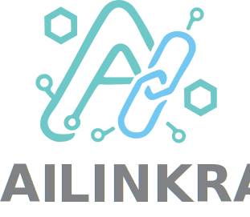

# AILinkra

  <a href="https://ailinkra.net">
     
     
<cite><small>Shared intelligence, infinite possibilities </small></cite>

  </a>

 

>[!WARNING]
> We are in a hard work in progress for [Polkadot Blockchain Academy Hackathon](https://polkadot.academy)  
> Come back at the end of September !!

## Our Credo

  <a href="https://ailinkra.net">
    
    
<cite><small>Shared intelligence, infinite possibilities </small></cite>

  </a>

 

Projects Principles:

- We **empower seamless collaboration**, ensuring that individual and collective contributions are recognized and rewarded.
- We foster **open participation** and **transparency** so all actions are clearly visible, auditable, and valued.
- We provide **trustless, verifiable systems**: outcomes and processes can be checked by anyone, anytime.
- We enable **fair and equitable distribution** of value generated—motivating deep, sustained engagement.
- We build for **scalability and resilience**, allowing the platform to grow and evolve as communities and needs expand.
- We commit to **privacy and security by design** in every interaction and transaction.
- We cultivate **interoperability**, bridging diverse users, tools, and resources fluidly.
- We pursue **continuous feedback and improvement**, aiming for measurable progress in user and contributor experience.
- We focus on **long-term sustainability and positive impact**, putting enduring value before short-lived results.
- We dedicate ourselves to **building for the long term**, prioritizing sustainable value over short-lived gains.
